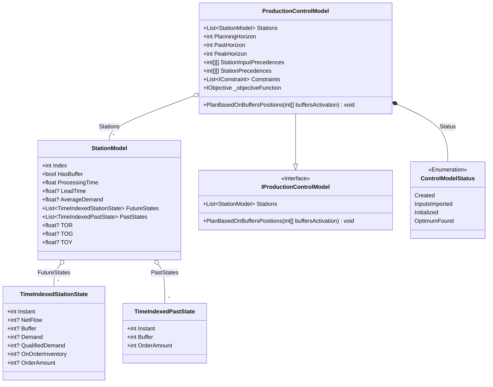
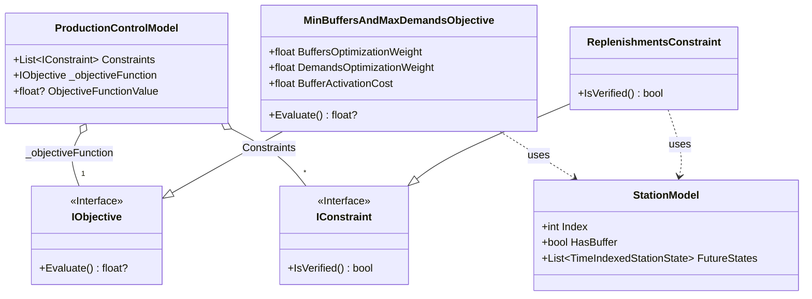
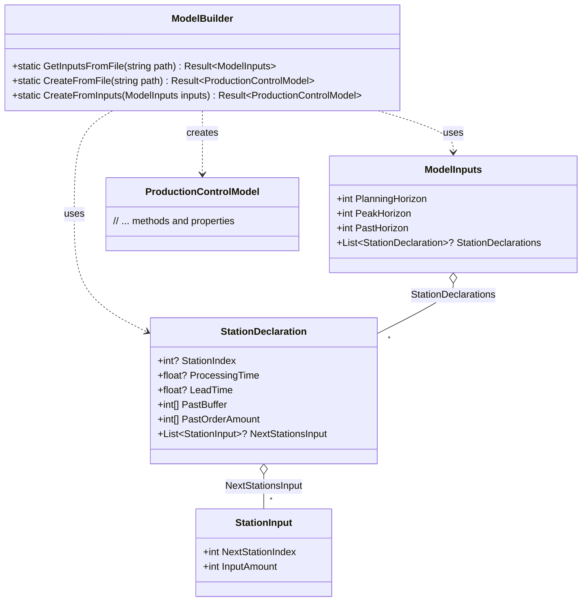
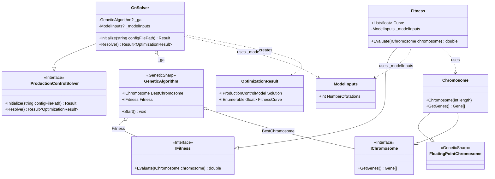

# SmartPPC.Core Documentation

## Introduction

The `SmartPPC.Core` library provides the core logic for a Demand Driven Material Requirements Planning (DDMRP) system. It provides a mathematical model (`ProductionControlModel`) for production control based on DDMRP principales. The library also dynamically explores the better buffers placement using  Genetic Algorithm based solver (`GnSolver`) to optimize the placement of buffers within the production line and produces a plannification in Planning horizon following DDMRP principales.

## DDMRP Model (`SmartPPC.Core.Model.DDMRP`)

The core of the DDMRP simulation is implemented in the [`SmartPPC.Core.Model.DDMRP.ProductionControlModel`](c:\Repos\DDMRP\SmartPPC\SmartPPC.Core\Model\DDMRP\ProductionControlModel.cs) class. This class provides a mathematical formulations of DDMRP.

### Key Components:

*   **[`SmartPPC.Core.Model.DDMRP.StationModel`](c:\Repos\DDMRP\SmartPPC\SmartPPC.Core\Model\DDMRP\StationModel.cs):** Represents a single station in the production line. It holds information like processing time, lead time (if applicable), demand forecast (for output stations), buffer status (`HasBuffer`), and calculated states over time ([`FutureStates`](c:\Repos\DDMRP\SmartPPC\SmartPPC.Core\Model\DDMRP\StationModel.cs), [`PastStates`](c:\Repos\DDMRP\SmartPPC\SmartPPC.Core\Model\DDMRP\StationModel.cs)). It also calculates buffer zones (TOR, TOY, TOG) if it has a buffer, based on average demand, variability, and lead times.
*   **[`SmartPPC.Core.Model.DDMRP.ProductionControlModel`](c:\Repos\DDMRP\SmartPPC\SmartPPC.Core\Model\DDMRP\ProductionControlModel.cs):** Orchestrates the simulation. It contains:
    *   A list of [`Stations`](c:\Repos\DDMRP\SmartPPC\SmartPPC.Core\Model\DDMRP\ProductionControlModel.cs).
    *  Plannification parameters including `PlanningHorizon` indicating the planning horizon, `PastHorizon` past horizon,`PeakHorizon` needed to for detecting incoming demands peak.
    *  `StationPrecedences` and `StationInputPrecedences` : Matrices defining the workflow and material flow between stations.
    *   `Constraints`: A list of constraints the model must satisfy (e.g., [`SmartPPC.Core.Model.DDMRP.ReplenishmentsConstraint`](c:\Repos\DDMRP\SmartPPC\SmartPPC.Core\Model\DDMRP\ReplenishmentsConstraint.cs)).
    *   An objective function ([`SmartPPC.Core.Model.IObjective`](c:\Repos\DDMRP\SmartPPC\SmartPPC.Core\Model\IObjective.cs)), implemented by [`SmartPPC.Core.Model.DDMRP.MinBuffersAndMaxDemandsObjective`](c:\Repos\DDMRP\SmartPPC\SmartPPC.Core\Model\DDMRP\MinBuffersAndMaxDemandsObjective.cs), used to evaluate the performance of a given buffer configuration.
*   **[`SmartPPC.Core.Model.DDMRP.ModelBuilder`](c:\Repos\DDMRP\SmartPPC\SmartPPC.Core\Model\DDMRP\ModelBuilder.cs):** Responsible for creating and configuring a `ProductionControlModel` instance from input data, typically loaded from a JSON file.
*   **[`SmartPPC.Core.Model.DDMRP.ModelInputs`](c:\Repos\DDMRP\SmartPPC\SmartPPC.Core\Model\DDMRP\ModelInputs.cs):** A class representing the structure of the input configuration data.

### Core Model Structure (Mermaid):

This diagram shows the main classes involved in representing the production line and its state over time.



### Objective and Constraints (Mermaid):

This diagram shows the classes responsible for evaluating the model's performance and ensuring constraints are met.



### Model Configuration and Building (Mermaid):

This diagram illustrates how the model is configured and constructed from input data.



### Planning Logic:

The [`PlanBasedOnBuffersPositions`](c:\Repos\DDMRP\SmartPPC\SmartPPC.Core\Model\DDMRP\ProductionControlModel.cs) method is central to the simulation. Given an array indicating which stations have buffers, an array generated using GA logique and its exploration, it performs the following steps:
1.  Calculates average demand and demand variability for each station based on downstream demands and forecasts.
2.  Sets the `HasBuffer` property for each station based on the input `buffersActivation`.
3.  Calculates the decoupled lead time for each station based on the buffer placement.
4.  Calculates the lead time factor for each station.
5.  Initializes the state (buffer level, on-order inventory, demand, qualified demand) for each station at time `t=0` based on past states and initial calculations.
6.  Iterates through the `PlanningHorizon` (from `t=1` onwards):
    *   For each station (processed in reverse order of index to ensure dependencies are met):
        *   Calculates the demand based on orders from downstream stations (or external forecast for output stations).
        *   If the station has a buffer:
            *   Calculates qualified demand (considering peak demands within the `PeakHorizon`).
            *   Calculates incoming supply based on lead times and upstream station states/orders ([`GetIncomingSupply`](c:\Repos\DDMRP\SmartPPC\SmartPPC.Core\Model\DDMRP\ProductionControlModel.cs)).
            *   Updates the buffer level based on previous buffer, demand, and incoming supply.
            *   Updates the on-order inventory based on previous on-order, incoming supply, and orders placed in the previous step.
            *   Calculates the Net Flow position (Buffer + On-Order - Qualified Demand).
            *   Determines if a replenishment order is needed based on the Net Flow position relative to the Top of Yellow (TOY) zone.
            *   Calculates the order amount based on the Net Flow position relative to the Top of Green (TOG) zone if replenishment is needed.

## Genetic Algorithm Solver ([`SmartPPC.Core.Solver.GA`](c:\Repos\DDMRP\SmartPPC\SmartPPC.Core\Solver\GA))

The [`SmartPPC.Core.Solver.GA.GnSolver`](c:\Repos\DDMRP\SmartPPC\SmartPPC.Core\Solver\GA\GnSolver.cs) class implements the `SmartPPC.Core.Solver.IProductionControlSolver` interface using the [`GeneticSharp`](https://github.com/giacomelli/GeneticSharp) library to find an optimal buffer placement strategy.

### Key Components:

*   **`SmartPPC.Core.Solver.GA.GnSolver`:** The main solver class.
    *   [`Initialize`](c:\Repos\DDMRP\SmartPPC\SmartPPC.Core\Solver\GA\GnSolver.cs): Reads the model configuration (`SmartPPC.Core.Model.DDMRP.ModelInputs`) using `SmartPPC.Core.Model.DDMRP.ModelBuilder` and sets up the `GeneticSharp.GeneticAlgorithm` instance with necessary components (Population, Fitness, Selection, Crossover, Mutation).
    *   [`Resolve`](c:\Repos\DDMRP\SmartPPC\SmartPPC.Core\Solver\GA\GnSolver.cs): Runs the configured GA (`_ga.Start()`). After the GA terminates, it retrieves the best chromosome, creates a `SmartPPC.Core.Model.DDMRP.ProductionControlModel` based on the input, applies the buffer configuration from the best chromosome using [`PlanBasedOnBuffersPositions`](c:\Repos\DDMRP\SmartPPC\SmartPPC.Core\Model\DDMRP\ProductionControlModel.cs), and returns the resulting model along with the fitness curve in an `SmartPPC.Core.Solver.GA.OptimizationResult`.
*   **`SmartPPC.Core.Solver.GA.Chromosome`:** Represents a potential solution (a specific buffer configuration). It's a binary chromosome where each gene corresponds to a station, and the gene's value (0 or 1) indicates whether that station has a buffer. Inherits from `GeneticSharp.FloatingPointChromosome`.
*   **`SmartPPC.Core.Solver.GA.Fitness`:** Evaluates the quality of a given `Chromosome`.
    *   The `Evaluate` method takes a chromosome, creates a `ProductionControlModel`, applies the buffer configuration from the chromosome using `PlanBasedOnBuffersPositions`, and then calculates the fitness.
    *   The fitness value is the inverse of the `ObjectiveFunctionValue` from the `ProductionControlModel` (since GeneticSharp aims to maximize fitness, and the objective function represents costs/undesired outcomes to be minimized). It also records the fitness value in the `Curve` list.
*   **GeneticSharp Components:** The solver uses standard components from the `GeneticSharp` library:
    *   `Population`: Manages the collection of chromosomes.
    *   `TournamentSelection`: Selects chromosomes for reproduction based on fitness.
    *   `UniformCrossover`: Combines genes from parent chromosomes.
    *   `FlipBitMutation`: Randomly alters genes in a chromosome.
    *   `FitnessStagnationTermination`: Stops the GA if the best fitness doesn't improve for a specified number of generations (configured to 100).

### GA Solver Structure (Mermaid):

This diagram shows the main classes involved in the Genetic Algorithm solver and their interaction with the model and the GeneticSharp library.



### Sequence Diagram (Resolve Process - Mermaid):

```mermaid
sequenceDiagram
    actor User
    participant GnSolver
    participant GA
    participant Fitness
    participant Model
    participant Chromosome
    participant Builder

    User->>GnSolver: Resolve()
    activate GnSolver

    GnSolver->>GA: Start()
    activate GA
 loop GA Generations
        GA->>Fitness: Evaluate(chromosome) %% GA passes an IChromosome activate Fitness note right of Fitness: Casts GA's IChromosome to SmartPPC.Chromosome
        
        Fitness->>Builder: CreateFromInputs(modelInputs) %% Creates a temporary model for evaluation
        activate Builder
        Builder-->>Fitness: controlModel
        deactivate Builder
        
        Fitness->>Chromosome: GetGenes() %% Called on the chromosome instance passed by GA
        activate Chromosome %% Represents interaction with the chromosome object
        
        Chromosome-->>Fitness: genes (buffersActivation)
        deactivate Chromosome
        
        Fitness->>Model: PlanBasedOnBuffersPositions(buffersActivation) %% Called on the temporary controlModel
        activate Model
        
        Model-->>Fitness:deactivate Model
        
        Fitness->>Model: ObjectiveFunctionValue %% Get value from temporary controlModel
        activate Model
        
        Model-->>Fitness: objectiveValue
        deactivate Model
        
        Fitness->>Fitness: RecordFitness(1 / objectiveValue) %% Adds to internal Fitness.Curve
        
        Fitness-->>GA: fitnessValue (1 / objectiveValue)
        deactivate Fitness %% GA performs Selection, Crossover, Mutation internally before next loop/termination
    end

    GA-->>GnSolver: BestChromosome %% GA returns the best IChromosome
    deactivate GA

    note right of GnSolver: Casts BestChromosome to SmartPPC.Chromosome
    GnSolver->>Chromosome: GetGenes() %% Called on the BestChromosome instance from GA
    activate Chromosome %% Represents interaction with the chromosome object
    Chromosome-->>GnSolver: bestBuffersActivation
    deactivate Chromosome

    GnSolver->>Builder: CreateFromInputs(modelInputs) %% Creates the FINAL model instance
    activate Builder
    Builder-->>GnSolver: finalModel
    deactivate Builder

    GnSolver->>Model: PlanBasedOnBuffersPositions(bestBuffersActivation) %% Called on the finalModel
    activate Model
    Model-->>GnSolver:
    deactivate Model

    GnSolver->>Fitness: Curve %% Access Fitness.Curve property containing recorded values
    activate Fitness
    Fitness-->>GnSolver: fitnessCurveData
    deactivate Fitness
    GnSolver-->>User: OptimizationResult(finalModel, fitnessCurve)
    deactivate GnSolver

```

## Usage

The solver can be used programmatically, for example, as demonstrated in the `SmartPPC.Console` project:

```csharp
// Example usage (simplified from SmartPPC.Console/Program.cs)
using SmartPPC.Core.Model.DDMRP;
using SmartPPC.Core.Solver;
using SmartPPC.Core.Solver.GA;
// ... other usings

public class ExampleUsage
{
    public static void RunOptimization(string configFilePath)
    {
        // 1. Instantiate the solver
        IProductionControlSolver solver = new GnSolver();

        // 2. Initialize the solver with the configuration file path
        var initResult = solver.Initialize(configFilePath);
        if (initResult.IsFailed)
        {
            Console.WriteLine($"Errors occurred during initialization: {string.Join(", ", initResult.Errors)}");
            return;
        }

        // 3. Run the optimization
        Console.WriteLine("Starting optimization...");
        var optResult = solver.Resolve();
        Console.WriteLine("Optimization finished.");


        if (optResult.IsFailed)
        {
            Console.WriteLine($"Errors occurred during optimization: {string.Join(", ", optResult.Errors)}");
            return;
        }

        // 4. Process the results
        var solution = optResult.Value.Solution; // The ProductionControlModel with the best buffer config applied
        var fitnessCurve = optResult.Value.FitnessCurve; // History of best fitness values (inverted objective)
        var buffersActivation = solution.ToGenes().Select(g => (int)g.Value).ToArray(); // The optimal buffer placement (0 or 1 per station)

        Console.WriteLine($"Optimal Buffer Placement: [{string.Join(",", buffersActivation)}]");
        Console.WriteLine($"Final Objective Value: {solution.ObjectiveFunctionValue}");
        Console.WriteLine($"Average Buffer Level: {solution.GetAverageBuffersLevel()}");
        Console.WriteLine($"Average Not Satisfied Demand: {solution.GetAverageNotSatisfiedDemand()}");

        // Optionally save detailed results or analyze the fitness curve
        // ResultsSaver.SaveResultsToCsv("./Results", (ProductionControlModel)solution, fitnessCurve);
    }
}
```

## Configuration (`DDRMP_ModelInputs.json`)

The solver and model are configured via a JSON file (e.g., `SmartPPC.Api/DDRMP_ModelInputs.json`). The structure is defined by `SmartPPC.Core.Model.DDMRP.ModelInputs` and related records like `SmartPPC.Core.Model.DDMRP.StationDeclaration`.

```json
// Example structure (refer to c:\Repos\DDMRP\SmartPPC\SmartPPC.Api\DDRMP_ModelInputs.json for a full example)
{
  "PlanningHorizon": 30, // Duration of the simulation (number of time steps)
  "PastHorizon": 3,      // Number of past time steps provided for initialization
  "PeakHorizon": 5,      // Horizon used to check for peak demands when calculating Qualified Demand
  "StationDeclarations": [
    {
      "StationIndex": 0,          // Unique index for the station (must be sequential starting from 0)
      "ProcessingTime": 100,      // Time units required to process one unit at this station
      "LeadTime": 2,              // Lead time for receiving materials (only for input stations, index 0 usually)
      "InitialBuffer": 20,        // Initial buffer level at t=0 (often overridden by PastBuffer)
      "PastBuffer": [ 10, 50, 20 ], // Buffer levels for the PastHorizon (t=-PastHorizon+1 ... t=0)
      "PastOrderAmount": [ 20, 50, 20 ], // Orders placed during the PastHorizon (t=-PastHorizon+1 ... t=0)
      "DemandVariability": null,  // Variability factor (only for output stations)
      "DemandForecast": null,     // Demand forecast list (size = PlanningHorizon, only for output stations)
      "NextStationsInput": [      // List of downstream stations this station feeds into
        {
          "NextStationIndex": 1,  // Index of the downstream station
          "InputAmount": 1        // Number of units required by the downstream station per unit it produces
        }
        // ... more outputs if applicable
      ]
    },
    // ... more station declarations
    {
      "StationIndex": 2, // Example output station
      "ProcessingTime": 50,
      "LeadTime": null,           // Lead time is calculated for non-input stations
      "InitialBuffer": null,
      "PastBuffer": [ 30, 40, 50 ],
      "PastOrderAmount": [ 30, 40, 50 ],
      "DemandVariability": 5,     // Required for output stations
      "DemandForecast": [ 17, 20, /* ... (size = PlanningHorizon) */ 45 ], // Required for output stations
      "NextStationsInput": null   // null or empty indicates this is an output station
    }
    // ...
  ]
}
```

**Key Configuration Points:**

*   `StationIndex` must be sequential starting from 0.
*   `LeadTime` is only specified for *input stations* (stations that don't receive input from other declared stations, typically index 0). For other stations, it's calculated based on buffer placement and upstream lead times.
*   `DemandVariability` and `DemandForecast` are only specified for *output stations* (those with `NextStationsInput` set to `null` or empty).
*   `PastBuffer` and `PastOrderAmount` arrays must have a size equal to `PastHorizon`. The last element corresponds to `t=0`.
*   `DemandForecast` array must have a size equal to `PlanningHorizon`.

